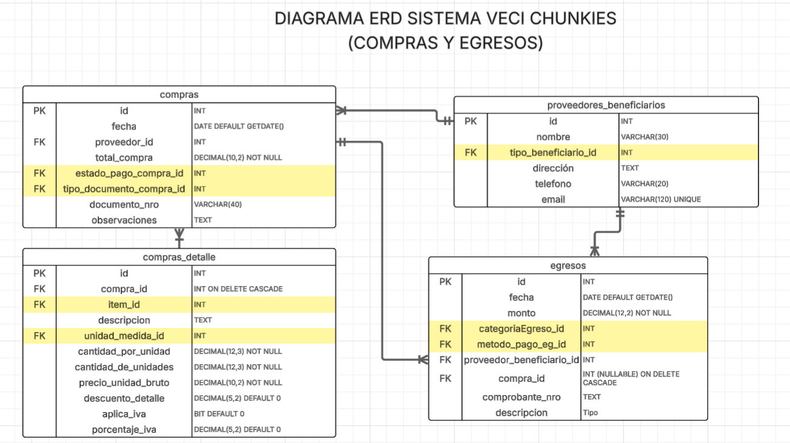

## 💼 SistemaVECI_chunkies
---
Sistema de gestión administrativa y contable para el negocio de galletas Chunkies. 
Desarrollado en T-SQL para ser ejecutado en Azure SQL Database o SQL Server.
---
## 📦 Funcionalidad principal
Este sistema permite gestionar:
- 🧑‍🤝‍🧑 Clientes y sus tipos/categorías
- 🍪 Productos clasificados por tipo
- 🧾 Ventas y detalle de productos por venta
- 💰 Ingresos por ventas u otros conceptos
- 📥 Compras y detalle de insumos comprados
- 💸 Egresos (automáticos y manuales)
- 📚 Catálogos configurables (tipos, formas de pago, unidades, etc.)
---
## Diagramas ERD

## ⚙️ Requisitos
- Azure SQL Database o SQL Server 2019+
- SQL Server Management Studio (SSMS) o Azure Data Studio
- Permisos para ejecutar scripts SQL con `CREATE`, `ALTER`, `DROP`, `TRIGGER`
---
## 🚀 Despliegue del sistema
1. **Eliminar restricciones existentes**  
   Ejecuta el archivo [`remove_foreign_keys.sql`](./remove_foreign_keys.sql) para eliminar constraints en caso de ejecuciones previas.
2. **Crear el esquema completo**  
   Ejecuta el archivo [`sistemaVECI_chunkies.sql`](./squema_sistemaVECI_Chunkies.sql) para crear las tablas, claves primarias, foráneas y catálogos.
---

## 🧩 Estructura de la base de datos
### Entidades principales
- `clientes`, `tipos_clientes`, `cat_tipo_clientes`, `cat_categoria_clientes`
- `productos`, `cat_tipo_producto`
- `ventas`, `ventas_detalles`, `cat_estado_pago`, `cat_tipo_documento`
- `ingresos`, `cat_forma_pago_ing`, `cat_categoria_ingreso`
- `compras`, `compras_detalle`, `cat_item_compra`, `cat_unidad_medida`
- `egresos`, `cat_forma_pago_eg`, `cat_categoria_egreso`
- `proveedores_beneficiarios`, `cat_tipo_beneficiario`
---
## 🔁 Automatizaciones incluidas
- Uso de `ON DELETE CASCADE` en relaciones críticas (como detalle de ventas y compras). Se elimina el detalle y el ingreso o egreso si se elimina una venta o una compra.
- Soporte para **soft delete** con el campo `eliminado BIT`.
---
## 📌 Notas
- Los catálogos pueden ser gestionados desde Power Apps si la base está conectada.
- Los porcentajes (como descuentos) se almacenan como `DECIMAL`, por ejemplo `0.15` para 15%.
---
## 🛠 Mantenimiento sugerido
- Usa `eliminado = 1` en lugar de eliminar registros críticos (soft delete).
- Asegura integridad referencial cargando primero los catálogos antes de insertar clientes, productos, etc.
- Usa vistas filtradas para mostrar solo registros `activos`.
---
## 📚 Licencia
Este proyecto está en desarrollo académico y no está licenciado para uso comercial sin autorización.

